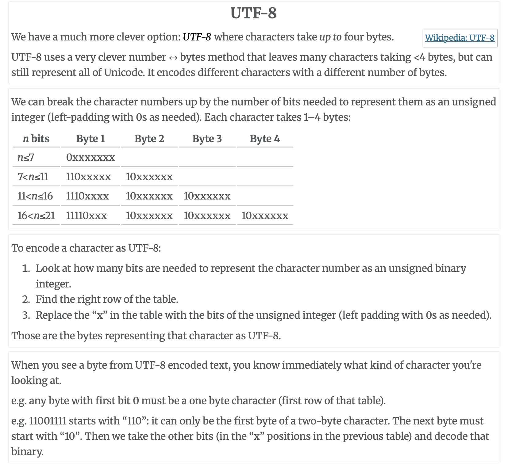

# Binary && Bits

## References

[Binary Representations](https://ggbaker.ca/295/content/binary.html)

### Two's Complement 

- Two's Complement of a binary str is => flip all bits and add 1

#### Representing Integers with Two's Complement

eg) 5 -> 0101 => 1010 + 1 (two's complement) => 1011                    // In 4-bit representation

BUT 5-> 0000 0101 => 1111 1010 + 1 (two's complement) => 1111 1011      // In 8-bit representation

##### An Important Distinction 

The CPU/program decides how to interpret those bits:

If the program says “treat this as an unsigned int (8 bits),” then: `11111011 = 251`

If the program says “treat this as a signed int (two’s complement, 8 bits),” then: `11111011 = -5`

If the program says “treat this as a character (ASCII/UTF-8),” then: `11111011` might not even be valid ASCII (ASCII is only 7 bits), but in extended encodings, it could map to some symbol.

### Integer Overflow

- Each program deals with overflow differently

- In C/C++, overflow is undefined.  As in, the compiler can do virtually anything in resonse.  => UNPREDICTABLE

- In Python, it switches to a bigger integer representations (if memory allows)

- In Assembly, we need to switch to a bigger register to represent the larger integer

### Character Representations

#### ASCII 

`ASCII` - is designed to represent English only

- There's 127 characters: {0-9} {A-Z} {a-z} {./?, ... punctuation} {\0 \n \t \a ... control chars}

- Each char is usually represented by one byte => as long as theres <= 256 chars, we can represent them

#### How are languages (NOT English) with hundreds of thousands characters (eg. Chinese) represented in the computer? (Answer: Unicode)

`Step 1:` make a list of every character humans use to express themselves. (How hard could it be? Currently around 160,000 are defined.)

`Step 2:` give each one a number. (Easy, once you have the list.)

`Step 3:` represent those with bits. (Hmmm…)

